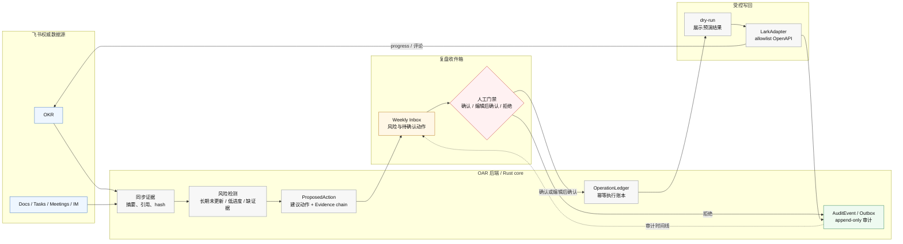

# OAR

OAR 是面向飞书企业租户的 OKR 复盘驾驶舱。

它帮助团队运行每周 OKR 运营节奏：发现执行风险，汇总证据，起草行动建议，让用户确认、编辑或拒绝，并且只在用户确认后安全写回飞书。

OAR 不是通用 OKR SaaS，不替代飞书 OKR，也不是绩效评价系统。第一版保持很窄：只做每周 OKR 复盘收件箱。

## 当前状态

阶段 0.5 已完成：`lark-okr` 已验证可用于本地 OKR 读取、progress 创建 / 更新验证和 fixture 回归。生产飞书集成主路径已收敛为 Rust 原生 OpenAPI adapter（`crates/oar-lark-adapter`）；progress 删除在 MVP 中仍保持 dry-run。

阶段 0.6 正在进行。当前已经不只是初始骨架，而是进入“过渡态验证”：

- `oar-core` 已包含 identity、token grant、device session、operation ledger、audit 和 Postgres schema contract。
- token refresh service、Postgres UoW、audit 映射和显式 `run_once` refresh sweep 已完成部分验证。
- 生产闭环尚未完成：真实 Feishu live network、后台 scheduler/daemon、revoke/reauth 处理和真实多端同步仍需继续验证。

## 产品切口

默认入口是复盘收件箱，不是聊天框，也不是大屏仪表盘。

用户每周应该看到：

- 需要关注的 OKR 风险。
- 来自 OKR、Docs、Tasks、Meetings、Minutes、Calendar 和 IM 的证据链。
- 带理由的建议动作。
- 每个写回动作的确认、编辑后确认、拒绝入口。
- 每次执行的审计时间线。

核心判断是：manager 和 PMO 不需要另一个创建 OKR 的地方，他们需要一个可靠的每周队列来运营已经存在的 OKR。

## 产品蓝图 (Product Blueprint)

OAR 的长期愿景不仅是“飞书外挂”，而是要成为飞书租户内的**目标执行智能运营系统**，以及飞书 OKR 的 **AI 幕僚长和受控智能体网关**。

### 每周复盘主链路



### 四大核心支柱

1. **高频复盘收件箱 (Weekly Inbox)**：不帮用户“创建/写 OKR”，而是通过精准的风险模型，帮助用户每周用 **10 分钟** 处理并清空 OKR 执行风险和待确认动作队列。
2. **可解释证据链 (Evidence Chain)**：绝不依赖黑盒生成。目标状态下，每一条智能体给出的风险警报与改动建议，都必须绑定来自 Docs、Tasks、IM 和妙记的脱敏证据引用与 Hash。当前实现仍处在 Phase 0.6 骨架验证阶段；证据存储、retention 和原文处理策略需要在后续 schema 中继续落地。
3. **严格人机门禁 (Human-in-the-Loop)**：将智能体能力控制在受限范围。L1（观察）、L2（诊断）、L3（建议）可以由后台自动准备；L4（执行写回）**必须由人类用户显式确认**；第一阶段坚决不做 L5（完全自主执行）。客户端离线时只能编辑草稿，不能离线确认真实写回；离线草稿和 `sync_cursor` 原子推进仍属于多端同步待验证能力。
4. **从“复盘工具”到“智能体网关” (A2A Roadmap)**：
   * **Phase 1-2**：深耕飞书 OKR 收件箱，闭环体验与强类型受控工具层。
   * **Phase 3**：对外提供只读 `A2A Server`，作为受控的飞书 OKR 智能体安全物理边界。
   * **Phase 4**：允许外部智能体提交 `ProposedAction`，但最后写回门禁依旧收口在 OAR 控制台，由人类确认执行。

## 安全模型

OAR 默认保守：

- 先读后写，写前 dry-run，执行前人工确认。
- 所有写回必须来自 `ConfirmedAction`。
- 业务代码只能通过 `LarkAdapter` 或明确设计过的 adapter 层调用飞书。
- `OperationLedger` 保证同一个确认动作只执行一次。
- `AuditEvent` 记录 actor、scope、target、before/after 摘要和执行结果。
- access token、refresh token、authorization code、raw CLI stdout/stderr、encrypted blob 和 fingerprint 不得出现在日志、审计 payload 或用户可见错误里。

## 目录结构

```text
.
├── crates/oar-core/       # Rust core：domain、Lark adapter、storage、execution、audit
├── docs/product/          # 产品定位、PRD、体验和市场判断
├── docs/architecture/     # 技术架构、安全权限、记忆架构和跨模块决策
├── docs/validation/       # 验证计划、阶段报告和实验结论
├── docs/reference/        # 飞书、竞品、A2A 等外部参考
├── Cargo.toml             # Rust workspace
└── AGENTS.md              # 项目级 AI agent 工作约束
```

`oar-core` 关键位置：

| 路径 | 作用 |
| --- | --- |
| `crates/oar-core/src/domain/identity.rs` | Tenant、OAR user、Lark identity、token grant 和 actor 模型 |
| `crates/oar-core/src/domain/device_sync.rs` | Device session 与 sync cursor 语义 |
| `crates/oar-core/src/domain/token_refresh/` | Token refresh 类型、决策、bridge 和 service |
| `crates/oar-core/src/action/` | ConfirmedAction、OperationLedger、AuditEvent、ExecutionPolicy |
| `crates/oar-core/src/lark/` | Lark adapter、parser、fixtures 和 auth refresh 边界 |
| `crates/oar-core/src/storage/postgres/` | SQL contract、Postgres repository、UoW、outbox worker |
| `crates/oar-core/migrations/` | Phase 0.6 Postgres migration 草案 |
| `crates/oar-lark-adapter/` | Rust 原生飞书 OpenAPI runtime adapter；生产集成放在 core 之外 |

模块路径说明：`domain::token_refresh` 和 `lark::auth` 不再提供 root facade re-export。新 Rust 代码应使用真实子模块路径，例如 `domain::token_refresh::{bridge,decision,service,types}` 和 `lark::auth::{adapter,parser,types}`。

## 开发验证

当前 workspace 包含 `oar-core` 和 `oar-lark-adapter`。`oar-core` 保持 core/storage/contracts 边界，不直接依赖 HTTP runtime、CLI 或 SDK；生产飞书集成固定收敛在 `oar-lark-adapter`，通过 Rust 原生 OpenAPI adapter 实现。refresh 生产装配走 async adapter：加密授权包来自 `token_grants`，Feishu app credential 由独立 provider 注入。当前只完成 fake transport / fixture / regression 验证，尚未宣称 live Feishu 已完成。

常用检查：

```bash
cargo fmt --check
cargo check --workspace --tests
cargo test -p oar-core
cargo test -p oar-lark-adapter
cargo test -p oar-core --features postgres
cargo clippy --workspace --all-targets -- -D warnings
cargo clippy -p oar-core --all-targets -- -D warnings
cargo clippy -p oar-core --features postgres --all-targets -- -D warnings
```

Postgres live tests 由 `DATABASE_URL` 控制。未设置时，默认测试仍会覆盖 domain / in-memory contract，以及 SQL text / schema contract。

```bash
DATABASE_URL=postgres://... cargo test -p oar-core --features postgres --test postgres_live_repository
```

## 文档地图

建议按这个顺序读：

1. [一页版项目简报](docs/product/one-page-brief.md)：产品判断和当前最大风险。
2. [产品总纲](docs/product/product-plan.md)：MVP 范围、关键假设和近期工作。
3. [MVP PRD](docs/product/prd.md)：需求、验收标准和风险。
4. [技术架构总览](docs/architecture/technical-architecture.md)：Swift/Rust/LarkAdapter/storage 设计。
5. [安全、权限与执行边界](docs/architecture/security-and-permissions.md)：执行边界和数据处理原则。
6. [验证计划](docs/validation/validation-plan.md)：阶段门、实验和停止标准。
7. [阶段 0.5 Lark CLI 验证报告](docs/validation/phase-0.5-lark-cli-validation-report.md)：OKR CLI 实测结论。
8. [阶段 0.6 身份与同步验证报告](docs/validation/phase-0.6-identity-sync-validation-report.md)：identity、token refresh、sync、idempotency 和 audit 进展。

完整文档目录见 [docs/README.md](docs/README.md)。

## 近期工作

下一步是把 Phase 0.6 已验证的组件推进到真实生产路径：

1. 接入真实 `AuthAdapter` / client，并验证安全解析到 `RefreshOutcome`。
2. 在现有显式 `run_once` sweep 边界上接入 scheduler/daemon 触发。
3. 扩展 Postgres UoW / audit 测试，覆盖 retry、timeout、stale fingerprint、revoke 和 reauth。
4. 证明 macOS、iOS 和飞书卡片入口能看到同一个后端动作状态。
5. 用真实团队跑复盘收件箱原型，验证每周使用习惯是否成立。
