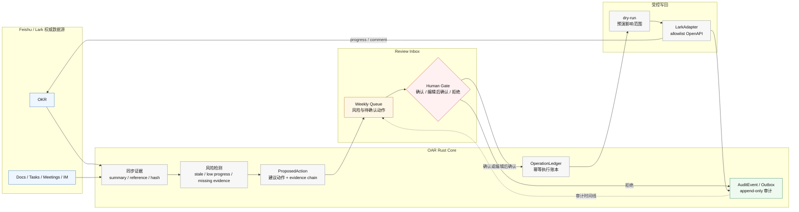

# OAR

> 面向飞书企业租户的 **OKR 复盘驾驶舱**：每周发现执行风险，汇总证据，起草行动建议，并且只在用户确认后安全写回飞书。

OAR 不是通用 OKR SaaS，不替代飞书 OKR，也不是绩效评价系统。第一版只做一件窄而高频的事：让 manager / PMO 每周用一个可靠的 Review Inbox 运营已经存在的 OKR。

| 维度 | 当前判断 |
| --- | --- |
| 当前阶段 | Phase 0.5 已完成；Phase 0.6 进行中 |
| 核心入口 | Weekly Review Inbox，不是聊天框或大屏仪表盘 |
| 权威数据源 | Lark / Feishu 负责原始租户数据；OAR 负责复盘、动作、审计和决策 |
| 生产集成 | Rust 原生 OpenAPI adapter（`crates/oar-lark-adapter`） |
| 安全原则 | 读先行、写前 dry-run、执行前人工确认、写后 append-only audit |

## 产品切口

很多团队已经在飞书里维护 OKR，真正痛的是每周持续运营它：

- KR 长期没人更新，风险暴露太晚。
- 证据分散在 OKR、Docs、Tasks、Meetings、Minutes、Calendar 和 IM 中。
- manager / PMO 需要手动整理周报、催进展、约同步、写评论。
- 企业不能接受黑盒自动执行，需要权限继承、证据链、人工确认和审计。

OAR 的第一性判断：

> OKR 的主要机会不在“帮人写目标”，而在“帮人每周运营目标执行风险”。

用户每周应该看到：

| 区域 | 作用 |
| --- | --- |
| 风险队列 | 展示长期未更新、低进度、缺证据或缺 owner 更新的 KR |
| 证据链 | 给出来源、摘要、引用、hash 和可见范围 |
| 建议动作 | 起草 progress、评论、提醒、任务或会议草稿 |
| 人工门禁 | 支持确认、编辑后确认、拒绝 |
| 审计时间线 | 记录谁基于什么证据确认了什么动作，结果如何 |

## 设计原则

| 原则 | 含义 |
| --- | --- |
| 高频复盘收件箱 | 不帮用户“创建 OKR”，而是帮助用户每周清空 OKR 执行风险和待确认动作 |
| 可解释证据链 | 每条风险警报和改动建议都必须绑定脱敏证据引用与 hash |
| 严格人机门禁 | L1-L3 可以自动准备；L4 写回必须由人类用户显式确认；第一阶段不做 L5 完全自主执行 |
| 受控 A2A 路线 | Phase 3 以后才开放只读 `A2A Server`；外部智能体即使能提交建议，写回仍由 OAR 人工门禁收口 |

## 主链路



## 当前状态

| 阶段 | 状态 | 结论 |
| --- | --- | --- |
| Phase 0.5 | 已完成 | `lark-okr` 已验证本地 OKR 读取、progress 创建 / 更新验证和 fixture 回归；progress 删除仍保持 dry-run |
| Phase 0.6 | 进行中 | identity、token grant、device session、operation ledger、audit 和 Postgres schema contract 已进入过渡态验证 |
| 生产闭环 | 未完成 | 真实 Feishu live network、后台 scheduler/daemon、revoke/reauth、多端同步仍需继续验证 |

已具备的工程基础：

- `oar-core` 已包含 identity、token grant、device session、operation ledger、audit 和 Postgres schema contract。
- token refresh service、Postgres Recorder、audit 映射和显式 `run_once` refresh sweep 已完成部分验证。
- 生产飞书集成主路径已从 CLI 验证收敛到 Rust 原生 OpenAPI adapter。

## 安全模型

OAR 默认保守，所有真实写回必须走同一条受控链路：

```text
ConfirmedAction -> OperationLedger -> LarkAdapter -> AuditEvent
```

关键约束：

- 先读后写，写前 dry-run，执行前人工确认。
- 所有写回必须来自 `ConfirmedAction`。
- 业务代码只能通过 `LarkAdapter` 或明确设计过的 adapter 层调用飞书。
- `OperationLedger` 保证同一个确认动作只执行一次。
- `AuditEvent` 记录 actor、scope、target、before/after 摘要和执行结果。
- access token、refresh token、authorization code、raw CLI stdout/stderr、encrypted blob 和 fingerprint 不得出现在日志、审计 payload 或用户可见错误里。

## 技术架构

| 层 | 选择 | 说明 |
| --- | --- | --- |
| macOS client | SwiftUI + AppKit bridge | Review Inbox 主体验 |
| iOS companion | SwiftUI | 轻量查看、提醒、确认入口 |
| Core / backend | Rust | domain、storage、execution、audit、sync contract |
| Feishu integration | `crates/oar-lark-adapter` | Rust 原生 OpenAPI runtime adapter |
| Backend runtime | `crates/oar-runtime` | 周期触发 tenant maintenance one-shot tick，不下沉 daemon 到 core |
| Storage | Postgres + pgvector | relational + vector，避免引入 graph DB |
| CLI | `lark-okr` | 仅用于验证、fixtures 和 regression tests |

目录概览：

```text
.
├── crates/oar-core/             # Rust core：domain、storage、execution、audit
├── crates/oar-lark-adapter/     # Rust 原生飞书 OpenAPI runtime adapter
├── crates/oar-runtime/          # 后台 runtime 壳：interval + cancellation
├── docs/project-overview.md     # 项目定位、路线图、核心决策
├── docs/review-inbox.md         # MVP PRD、复盘收件箱体验和工作流
├── docs/system-architecture.md  # Rust core、storage、LarkAdapter、scheduler 架构
├── docs/feishu-integration.md   # Phase 0.5 飞书 / Lark CLI 验证结论
├── docs/identity-auth-sync.md   # Phase 0.6 identity、auth refresh、device sync 验证
├── docs/execution-audit.md      # ConfirmedAction、OperationLedger、AuditEvent 和权限边界
├── docs/memory-evidence.md      # 证据链、三层记忆和检索设计
├── docs/validation-plan.md      # 总体验证计划、阶段门和停止标准
├── docs/reference/              # 外部参考、竞品、依赖雷达和技术资料
├── Cargo.toml                   # Rust workspace
└── AGENTS.md                    # 项目级 AI agent 工作约束
```

`oar-core` 关键位置：

| 路径 | 作用 |
| --- | --- |
| `crates/oar-core/src/domain/identity.rs` | Tenant、WorkspaceUser、Lark identity、token grant 和 actor 模型 |
| `crates/oar-core/src/domain/device_sync.rs` | Device session 与 sync cursor 语义 |
| `crates/oar-core/src/domain/token_refresh/` | Token refresh 类型、决策、bridge 和 service |
| `crates/oar-core/src/action/` | ConfirmedAction、OperationLedger、AuditEvent、ExecutionPolicy |
| `crates/oar-core/src/lark/` | Lark adapter、parser、fixtures 和 auth refresh 边界 |
| `crates/oar-core/src/storage/postgres/` | SQL contract、Postgres repository、Recorder、outbox worker |
| `crates/oar-core/migrations/` | Phase 0.6 Postgres migration 草案 |

模块路径说明：`domain::token_refresh` 和 `lark::auth` 不再提供 root facade re-export。新 Rust 代码应使用真实子模块路径，例如 `domain::token_refresh::{bridge,decision,service,types}` 和 `lark::auth::{adapter,parser,types}`。

## 开发验证

当前 workspace 包含 `oar-core`、`oar-lark-adapter` 和 `oar-runtime`。`oar-core` 保持 core/storage/contracts 边界，不直接依赖 HTTP runtime、CLI 或 SDK；生产飞书集成固定收敛在 `oar-lark-adapter`，常驻调度语义收敛在 `oar-runtime`。

常用检查：

```bash
cargo fmt --check
cargo check --workspace --tests
cargo test -p oar-core
cargo test -p oar-lark-adapter
cargo test -p oar-runtime
cargo test -p oar-core --features postgres
cargo clippy --workspace --all-targets -- -D warnings
cargo clippy -p oar-core --all-targets -- -D warnings
cargo clippy -p oar-core --features postgres --all-targets -- -D warnings
```

Postgres live tests 由 `DATABASE_URL` 控制。未设置时，默认测试仍会覆盖 domain / in-memory contract，以及 SQL text / schema contract。

```bash
DATABASE_URL=postgres://... cargo test -p oar-core --features postgres --test postgres_live_repository
```

## 文档地图

建议按这个顺序读：

1. [项目概览](docs/project-overview.md)：定位、路线图、关键风险和阶段状态。
2. [复盘收件箱](docs/review-inbox.md)：需求、验收标准与工作流。
3. [系统架构总览](docs/system-architecture.md)：Swift/Rust/LarkAdapter/storage 设计。
4. [执行与审计边界](docs/execution-audit.md)：执行边界和数据处理原则。
5. [验证计划](docs/validation-plan.md)：阶段门、实验和停止标准。
6. [阶段 0.5 飞书集成验证](docs/feishu-integration.md)：OKR CLI 实测结论。
7. [阶段 0.6 身份与同步验证](docs/identity-auth-sync.md)：identity、token refresh、sync、idempotency 和 audit 进展。

完整文档目录见 [docs/README.md](docs/README.md)。

## 近期工作

下一步是把 Phase 0.6 已验证的组件推进到真实生产路径：

- [ ] 接入真实 `AuthAdapter` / client，验证安全解析到 `RefreshOutcome`
- [ ] 在现有显式 `run_once` sweep 边界上接入 scheduler/daemon 触发
- [ ] 扩展 Postgres Recorder / audit 测试，覆盖 retry、timeout、stale fingerprint、revoke 和 reauth
- [ ] 证明 macOS、iOS 和飞书卡片入口能看到同一个后端动作状态
- [ ] 用真实团队跑复盘收件箱原型，验证每周使用习惯是否成立
