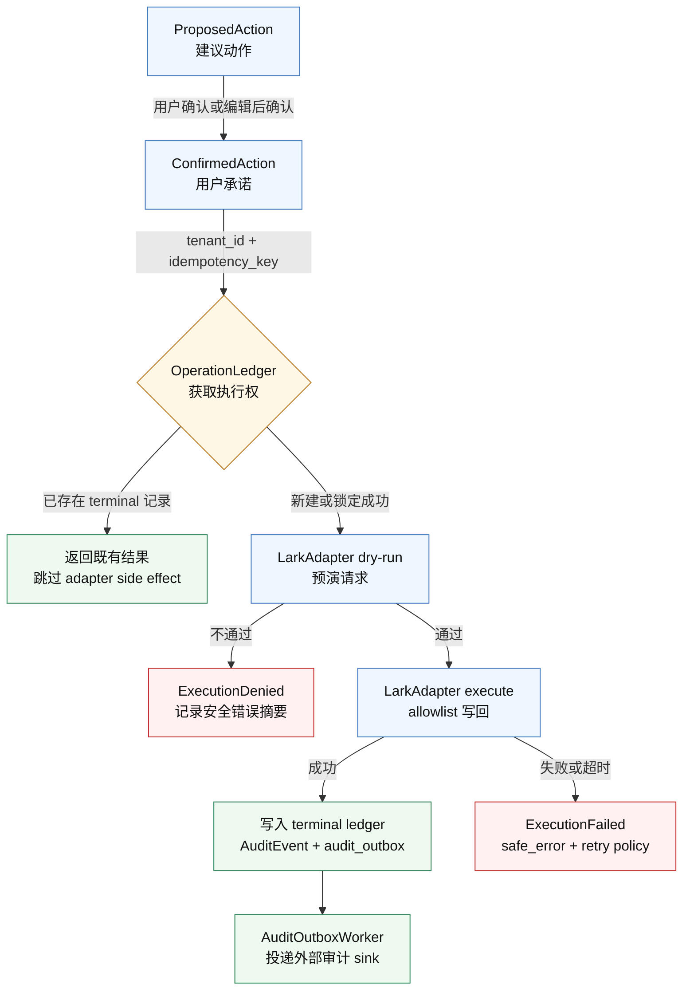

# 技术架构总览

更新日期：2026-05-26

## 1. 架构原则

OAR 的技术形态：

> Swift 原生前端 + Rust 后端/core + LarkAdapter + 服务端智能体运行时。

核心原则：

- 飞书是 OKR、Docs、Tasks、Meetings、Calendar、IM 的权威数据源。
- OAR 后端是复盘、待确认动作、审计事件、证据索引、记忆和同步游标的权威数据源。
- iOS / macOS / 飞书入口负责交互、查看和审批。
- 7x24 调度、同步、审计和工具执行在后端完成。

## 2. 原生技术形态

推荐实现：

| 层 | 技术 | 说明 |
| --- | --- | --- |
| macOS | SwiftUI + AppKit bridge | 原生窗口、sidebar、command menu、通知、deep link |
| iOS | SwiftUI | 轻量审批和提醒，不承载完整智能体运行时 |
| 后端 / Core | Rust | LarkAdapter、队列、审计、策略、工具执行、同步引擎 |
| 本地通信 | local HTTP / gRPC / XPC | macOS shell 可连本地 core；生产更推荐后端服务 |
| 服务端 | Rust service | 7x24 任务、OAuth token、同步、A2A server、审计存储 |
| 存储 | Postgres + 对象存储 + 向量索引 | 审计、待确认动作、证据摘要、记忆 |

关键判断：

- iOS 不适合作为 7x24 智能体执行环境，只作为审批和查看端。
- macOS 可以有本地 core，但不能依赖用户电脑在线完成组织级复盘。
- 真实 7x24 能力必须在服务端智能体运行时。
- Swift 前端只负责体验和状态展示，所有写回都通过后端的 `ConfirmedAction`。

## 3. Lark CLI 优先原则

OAR 是基于 Lark CLI 开发的应用，但不能只是“调用 CLI”。业务层必须 **LarkAdapter 优先**，阶段 0.5 已确认 OKR 主路径可走 Lark CLI；生产仍需保留 OpenAPI 兜底路径。

核心技术原则：

> 把 Lark CLI 产品化成安全、可审计、可回滚的智能体工具层。

保守原则：

- 当前能力以本机安装版本的 schema 快照为准。
- 生产环境锁定 CLI 版本，不自动升级。
- 所有调用经过 `LarkAdapter`。
- 每个 command 都要有 allowlist、超时、输出长度限制、脱敏和审计。
- OpenAPI 兜底路径必须设计进架构，不能把 CLI 当成不可替换黑盒。

阶段 0.5 实测结果见：[`phase-0.5-lark-cli-validation-report.md`](../validation/phase-0.5-lark-cli-validation-report.md)。

## 4. LarkAdapter

所有飞书能力必须经过 `LarkAdapter`，业务代码不直接散落调用 CLI 或 OpenAPI。

| Adapter | 责任 |
| --- | --- |
| `OkrAdapter` | 读取周期、Objective、KR、progress、alignment；必要时写回低风险进度或评论 |
| `EvidenceAdapter` | 从 Docs、Tasks、Meetings、Minutes、IM、Calendar 收集证据 |
| `ActionAdapter` | 将建议动作转成任务、提醒、评论、会议草稿 |
| `AuthAdapter` | 管理 app/user/bot 身份、scope 检查、缺权限引导 |
| `AuditAdapter` | 记录 CLI/OpenAPI 调用、dry-run、确认、执行结果 |

最小接口：

```text
list_okr_cycles(user_id, user_id_type) -> OkrCycle[]
get_okr_cycle_detail(cycle_id) -> OkrCycleDetail
list_progress(target_id, target_type) -> ProgressRecord[]
dry_run_create_progress(request) -> ToolDryRun
create_progress(confirmed_action_id, request) -> ProgressRecord
dry_run_update_progress(request) -> ToolDryRun
update_progress(confirmed_action_id, request) -> ProgressRecord
```

所有写方法必须接收 `confirmed_action_id`，并写入 `AuditEvent`。

### 4.1 ConfirmedAction 执行链路

当前 Phase 0.6 要证明的核心链路是：同一个确认动作只能进入一次外部写回路径，且每次结果都能被审计追溯。



注意：外部写回是不可回滚 side effect。`audit_outbox` 用来缩小“adapter 已成功但外部审计投递失败”的窗口；真实 crash recovery 和外部 sink 集成仍是 Phase 0.6 后续验证点。

## 5. 账号、身份与 7x24

账号模型：

| 对象 | 作用 |
| --- | --- |
| `Tenant` | 飞书企业租户，数据隔离和计费边界 |
| `OarUser` | OAR 内部用户，保存偏好、角色、记忆设置 |
| `LarkIdentity` | 飞书用户身份绑定，如 `open_id`、`union_id`、租户信息 |
| `RoleBinding` | manager、PMO、admin、viewer 等 OAR 内角色 |
| `DeviceSession` | macOS / iOS / web / 飞书入口的登录设备和会话 |
| `TokenGrant` | 用户或企业授权给 OAR 的 OAuth grant，必须加密存储 |
| `AgentActor` | 智能体执行时使用的身份描述，不直接等同于某个 token |

执行身份：

| 身份 | 来源 | 适合场景 |
| --- | --- | --- |
| `user_delegated` | 用户 Lark OAuth 登录后授权 | 读取用户可见 OKR、日历、任务、文档；执行用户确认后的写回 |
| `bot_actor` | 飞书 Bot / 企业自建应用 | 发消息卡片、提醒、确认入口、系统通知 |
| `app_actor` | 企业应用授权 | 组织级同步、公开团队 OKR、后台批处理 |
| `service_actor` | OAR 后端内部身份 | 调度、队列、审计、模型任务 |
| `approved_user_action` | 用户确认后的动作 | 写评论、建任务、提醒 owner、更新低风险字段 |

关键原则：

- Lark 登录可以自动绑定用户身份，但不能自动放大成“智能体拥有该用户全部权限”。
- 实际可用权限必须取 Lark app scopes、用户授权、资源权限和 OAR 策略 allowlist 的交集。
- 如果需要 7x24 后台运行，需要申请 `offline_access`。
- `refresh_token` 只在用户授予 `offline_access` 时返回。
- 刷新成功后必须保存新的 refresh token，原 refresh token 可能失效。
- 客户端只保存 OAR session，不长期保存飞书 refresh token。
- `TokenGrant` repository 边界只接受/返回加密授权包，不暴露明文 OAuth token。

## 6. 多端同步

飞书与 OAR 的职责分界：

| 系统 | 作为权威数据源的数据 |
| --- | --- |
| 飞书 | OKR、Docs、Tasks、Meetings、Calendar、IM 原始数据 |
| OAR 后端 | 每周复盘、待确认动作、审计事件、证据索引、记忆、同步游标 |
| 客户端 | UI 缓存、草稿、设备会话，不保存长期 token |

同步原则：

- 所有客户端通过 `sync_cursor` 拉取增量状态。
- 写操作必须使用 `idempotency_key`。
- 后端维护 `OperationLedger`，记录待确认、已确认、执行中、已成功、已失败、已取消。
- 同一个待确认动作在 macOS / iOS / 飞书卡片中的状态必须一致。
- 客户端离线时只能编辑草稿，不能离线确认真实写回。

## 6.1 Phase 0.6 持久化草案

Phase 0.6 的首版 Postgres migration 草案位于：

[`../../crates/oar-core/migrations/0001_phase_0_6_identity_action_audit.sql`](../../crates/oar-core/migrations/0001_phase_0_6_identity_action_audit.sql)

覆盖对象：

| 表 | 责任 |
| --- | --- |
| `tenants` | 企业租户隔离边界 |
| `oar_users` | OAR 内部用户 |
| `lark_identities` | 飞书身份绑定 |
| `token_grants` | OAuth grant 元数据和加密授权包 |
| `device_sessions` | 多端会话和同步游标 |
| `confirmed_actions` | 用户确认后的动作 |
| `operation_ledger` | 幂等执行账本 |
| `audit_events` | append-only 审计事件 |
| `audit_outbox` | adapter 副作用与审计持久化之间的 crash-window 缓冲 |

关键约束：

- `confirmed_actions (tenant_id, idempotency_key)` 唯一。
- `operation_ledger (tenant_id, idempotency_key)` 唯一。
- `operation_ledger.action_id` 引用 `confirmed_actions.action_id`。
- `audit_events (trace_id, sequence)` 唯一。
- `audit_events` 有 `BEFORE UPDATE` / `BEFORE DELETE` trigger 阻止静默修改。
- `token_grants` 不使用明文 `access_token` / `refresh_token` 列名，授权材料保存为 `encrypted_oauth_grant`、`oauth_grant_key_id`、`oauth_grant_fingerprint`。
- refresh rotation 采用 SQL CAS：`tenant_id + grant_id + expected_fingerprint` 命中且 grant 状态属于 `valid` / `needs_refresh` / `expired`、并满足 `revoked_at IS NULL` 与 `reauth_required_at IS NULL` 时才允许更新。
- 已撤销或已标记 reauth-required 的 grant 必须在 SQL 层直接阻断 rotation，不依赖上层重试逻辑。

当前边界：

- Rust core 默认构建仍使用 repository trait + in-memory repository 验证语义。
- Rust core 已新增 `storage::postgres` SQL 边界，覆盖 confirmed action / ledger upsert、guarded status transition、audit append、audit outbox enqueue 和 outbox claim/sent/retry/failed 状态更新。
- Rust core 已新增 Postgres `PostgresExecutionUnitOfWork` storage 边界，可在一个 DB transaction 内提交 ledger + audit + outbox，并用 live tests 验证 audit append 失败时 ledger/outbox 一起回滚。
- Rust core 已新增 feature-gated async `PostgresActionExecutor` 运行时路径，覆盖 `ConfirmedAction -> dry-run -> execute -> terminal audit/outbox`，重复执行会跳过 adapter 和重复 side effects。
- Rust core 已新增 feature-gated `PostgresAuditOutboxWorker` 最小 drain 路径，使用 `attempt_count + lease_until` guard 防止陈旧 worker 误标 sent/retry/failed。
- `postgres` / `postgres-sqlx` feature 可编译 `sqlx` 版 Postgres repository 类型；默认构建仍不拉起数据库运行时依赖。
- 下一步需要接入真实后台调度、外部审计投递 sink、crash recovery，以及更接近生产的并发压力测试。

## 6.2 Phase 0.6 下一切片：Identity Repositories + TokenRefreshDecision Bridge

状态声明：以下语义为当前实现/验证方向，属于进行中；只有在代码与集成测试覆盖后才可视为生产完成。

模块边界约定（当前实现）：

- `domain::token_refresh` 与 `lark::auth` 已移除 root `pub use` / facade 兼容。
- 新代码与文档示例应使用真实子模块路径：`domain::token_refresh::{bridge,decision,service,types}` 与 `lark::auth::{adapter,parser,types}`。

Phase 0.6 refresh 集成状态按三层区分（不得混写为“已生产就绪”）：

1. 安全 parser / adapter contract 层：定义可安全消费的 refresh 输入输出边界与 `RefreshOutcome` 映射（当前：部分通过）。
2. fixture replay -> Postgres orchestrator/UoW/audit 层：以 fixture/fake adapter 验证 refresh 决策、CAS 持久化与 append-only 审计事务边界（当前：部分通过）。
3. 真实 `AuthAdapter` client + scheduler 层：接入真实 `lark-cli` / OpenAPI refresh client 与后台调度闭环（当前：未完成）。

当前切片说明（scheduler 前置能力，已部分验证）：

- 当前验证的是“安全候选选择 + 显式单次 sweep”，而不是后台调度执行：在 Postgres 侧按 `tenant_id` 选择 refresh due-candidates。
- 在候选选择之上，已新增“显式单次 sweep / `run_once`”执行切片：仅在人工或上层流程显式触发时运行一次，逐 grant 调用既有 orchestrator/UoW/audit 编排链路。
- 候选范围仅限 `due` / `needs_refresh` / `expired`，并在查询层排除 `revoked` / `reauth_required` grant。
- 返回快照遵循最小暴露：仅返回 grant id、tenant id、状态、是否有 refresh material、CAS 所需 fingerprint 等编排必需元数据；不返回 `encrypted_oauth_grant` 或任何明文 token，fingerprint 不得写入日志或审计。
- sweep 事务边界保持在“每 grant 一次 orchestrator/UoW 事务提交”，不将整轮 sweep 作为单个跨 grant 大事务。
- 已加入 `DATABASE_URL`-gated Postgres live tests 覆盖单次 sweep 的成功批次、顺序审计、候选过滤继承、`limit = 0` 不调用 adapter 且不写 audit。
- 该能力用于后续 scheduler/worker 对接前的安全编排准备，不应表述为“已完成后台 refresh scheduler/daemon”或“已具备无人值守后台 refresh”。

### Tenant / OarUser / LarkIdentity Postgres repositories（进行中）

- `tenants`、`oar_users`、`lark_identities` 作为身份主干表，所有读写均以 `tenant_id` 作为隔离前提。
- `LarkIdentity` 绑定只允许经 adapter 层写入，业务层不直接拼接飞书身份字段，避免绕开审计与策略边界。
- repository 需提供显式的唯一性与冲突语义（如同租户下 identity 重复绑定），供上层流程做幂等恢复。
- identity repository 不持久化明文 token；授权材料仍只经 `TokenGrant` 加密字段边界流转。
- identity 变更必须可审计：至少记录 actor、绑定目标、变更前后摘要和 trace 关联。

### DeviceSession Postgres repository 语义（进行中）

- `device_sessions` 按 `tenant_id` 强隔离，所有读写必须携带租户上下文。
- repository 负责单调 `sync_cursor` 推进：新 cursor 必须严格大于旧值；回退或重复值被拒绝并返回冲突结果。
- repository 负责会话状态门禁：当会话被 revoke/expired 时，拒绝 cursor 推进与后续同步状态推进。
- repository 只保存 OAR 会话与同步元数据，不持久化飞书明文 token。
- 多端并发下以 SQL 原子条件更新保证“只前进不回退”，并为上层返回可审计的冲突信号。

### TokenRefreshService 编排边界（进行中）

- `TokenRefreshService` 只负责 grant 生命周期编排：到期判断、refresh 尝试、rotation 持久化、revoke/reauth 判定与审计记录。
- `TokenRefreshService` 当前可复用 Postgres 租户级 due-candidate 安全筛选作为 refresh attempt 输入前置，并可由显式单次 sweep（`run_once`）逐 grant 驱动；该步骤本身不触发后台调度循环。
- service 不向上层返回明文 access/refresh token；跨 repository 边界仅传递加密授权包与指纹元数据。
- refresh rotation 必须经 `TokenGrant` repository 的 SQL CAS guard（`tenant_id + grant_id + expected_fingerprint + state guard`）原子提交。
- grant 处于 revoked 或 reauth-required 时，service 必须短路并返回可恢复错误，不触发后台写操作。
- service 不直接调用任意 CLI/OpenAPI；与飞书交互必须经 `LarkAdapter/AuthAdapter` 封装路径，保留 dry-run/审计一致性。
- service 仅处理授权材料与状态，不直接执行 OKR 写回；业务写回仍必须走 `ConfirmedAction -> OperationLedger -> LarkAdapter -> AuditEvent`。
- `TokenRefreshAuditSummary` 可通过 `token_refresh_audit_event` 映射为 append-only `AuditEvent`：复用现有 `ExecutionSucceeded` / `ExecutionFailed` / `ExecutionDenied` 类型，用 `target.resource_type = token_grant` 与稳定 `action_type` 区分 refresh 场景。
- refresh 审计事件只记录 grant id、tenant id、状态分类、命令分类和已脱敏 `safe_error`；不得记录 access token、refresh token、authorization code、raw CLI stdout/stderr、encrypted blob、fingerprint、完整授权包或 sink 内部错误。
- fingerprint 仅作为 CAS/并发控制元数据参与编排，不进入日志正文、审计 payload 或对外可见错误。
- 当前已在 Postgres live tests 验证 refresh 状态更新 + audit append 的事务化 UoW 语义（同事务提交、审计失败整体回滚）。
- `PostgresTokenRefreshOrchestrator` 已验证 fake `AuthRefreshAdapter` -> domain decision -> transactional UoW -> audit 的编排边界；短路路径不调用 adapter / UoW，只写 denied audit。
- `PostgresTokenRefreshSweep` 已验证 tenant-scoped due-candidate 安全筛选到显式单次 `run_once` 的桥接边界，逐 grant 沿用 orchestrator/UoW/audit 事务语义。
- Auth refresh 的真实 `lark-cli` / OpenAPI client 尚未接入，后台 scheduler/daemon 也尚未连通；当前仅验证 contract + fixture + orchestration 边界，并新增了“tenant-scoped due-candidate 安全筛选 + 显式单次 `run_once` sweep”前置能力，不构成生产 refresh 闭环。

### Auth refresh adapter contract / parser fixture 安全边界（下一切片，进行中）

- `AuthAdapter` refresh 路径当前只对接“安全解析边界”，输入/输出以 fixture 驱动验证，不直接信任原始 CLI/OpenAPI 输出。
- parser 边界仅接受“加密授权包 envelope”（如 `encrypted_oauth_grant`、`oauth_grant_key_id`、`oauth_grant_fingerprint` 及最小状态元数据），不接受明文 token 字段穿透到 domain。
- parser 必须拒绝任何 plaintext token-like 输出：包含 access token、refresh token、authorization code 或等价敏感片段时，直接返回安全错误并停止后续 refresh 编排。
- parser 输出必须映射为领域 `RefreshOutcome`（`Success` / `TransientFailure` / `ReauthFailure`），再由 `TokenRefreshDecision` bridge 映射到持久化命令。
- 安全错误仅允许输出 allowlist 摘要（`safe_error`）；不得记录或暴露 access token、refresh token、authorization code、raw CLI stdout/stderr、完整 adapter 原始响应。
- 该边界只解决“可安全消费的 refresh 结果建模”；真实 refresh 请求发送、重试节奏和调度生命周期仍待后续接入真实 `AuthAdapter` client + 后台 scheduler。

### TokenRefreshDecision persistence bridge（进行中）

- 引入 `TokenRefreshDecision` 作为 refresh 编排与持久化之间的显式桥接对象，用于表达 CAS rotation、needs-refresh 和 reauth-required 等持久化意图。
- bridge 的责任是把决策安全映射到 repository 可执行操作（如 CAS rotation、标记 needs-refresh、标记 reauth-required），并保留后续日志/审计所需的最小上下文。
- bridge 不承载明文 token，不向外暴露授权原文；仅携带指纹、状态、时间窗口和错误分类等最小必要元数据。
- 当 grant 已 revoked 或 reauth-required 时，refresh 编排必须在生成写入命令前短路，并输出可恢复错误给上层。
- bridge 只覆盖授权生命周期，不改变业务写回门禁：任何 OKR 写操作仍必须来自 `ConfirmedAction`，并通过 `OperationLedger` 与 `AuditEvent` 留痕。

## 7. 智能体运行时与模型配置

OAR 的智能不应该来自一次 LLM 调用，而应该来自：

> 模型编排 + 可追溯证据 + 可学习的团队记忆 + 可版本化策略。

模型角色：

| 模型角色 | 用途 | 要求 |
| --- | --- | --- |
| `fast_model` | 分类、摘要、长期未更新检测、低风险初筛 | 低延迟、低成本、稳定 JSON |
| `reasoning_model` | 每周复盘、复杂风险判断、建议动作 | 推理强、上下文长、结构化输出 |
| `embedding_model` | 证据检索、记忆检索 | 向量质量稳定、可批量处理 |
| `local_or_private_model` | 高敏企业数据场景 | 可私有化、可审计、可按租户关闭外部模型 |

每次生成复盘或建议动作时记录：

- `prompt_version`
- `policy_version`
- `model_provider`
- `model_version`
- `tool_schema_version`
- `output_schema_version`
- `evidence_ids`
- `memory_ids`
- `trace_id`

记忆架构见：[`memory-architecture.md`](memory-architecture.md)。

## 8. 证据链

OAR 的每条智能体判断都必须绑定来源。

| 智能体判断 | 可用证据来源 |
| --- | --- |
| KR 长期未更新 | OKR 更新时间、owner 最近消息、任务更新时间 |
| KR 低于预期节奏 | OKR progress、任务完成率、会议/文档中的阻塞点 |
| owner 未响应 | IM 搜索、任务评论、OKR 评论、会议纪要 |
| 目标缺证据 | Docs/Wiki/Minutes/Tasks 中找不到关联上下文 |
| 需要跟进 | Minutes 待办、Calendar 空档、Tasks 未完成项 |
| 可以更新 progress | 已完成任务、会议结论、owner check-in、Base/Sheets 指标 |

MVP 原则：优先保存摘要、来源引用和 hash，不默认保存完整原文。
