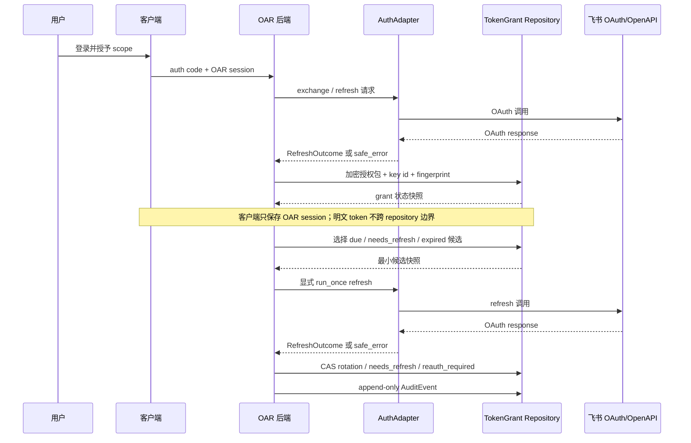

# 安全、权限与执行边界

更新日期：2026-05-31

## 1. 核心原则

OAR 的默认安全原则：

> 先读后写、写前预演、执行前人工确认。

智能体可以自动观察、诊断、起草，但不能自动代表人做组织承诺。

人在 OAR 中不是被智能体替代的执行者，而是目标判断、授权和组织承诺的负责人。

人机分工：

| 维度 | 人负责 | 智能体负责 |
| --- | --- | --- |
| 目标意义 | 判断目标是否还重要、是否要调整 | 发现目标是否失焦、是否缺进展 |
| 风险判断 | 决定风险是否真实、优先级多高 | 找出长期未更新、低进度、缺证据和阻塞点 |
| 组织动作 | 决定是否提醒、约会、写评论、更新进度 | 起草提醒、会议、评论、复盘和建议动作 |
| 权限授权 | 确认哪些动作可以写回飞书 | 生成 dry-run、执行请求和审计日志 |
| 信任校准 | 反馈建议为什么不对 | 记录拒绝原因，下次减少同类建议 |
| 责任归属 | 对最终写回和组织影响负责 | 提供可追溯、可解释、可审计的过程 |

## 2. 执行安全模型

执行链路：

1. 智能体产生意图，例如“提醒 owner 更新 KR”。
2. OAR 将意图转成受控工具请求。
3. `LarkAdapter` 生成 dry-run 结果。
4. OAR 将 dry-run 结果展示为 `ProposedAction`。
5. 用户确认或编辑后确认。
6. 后端执行 allowlist 中的 OpenAPI 操作；CLI 仅用于本地验证和 fixture 回归。
7. 写入 `AuditEvent`，并显示到审计时间线。

必须限制：

- OpenAPI operation allowlist。
- target object allowlist。
- scope allowlist。
- tenant/user context 校验。
- timeout、retry、rate limit。
- 输出长度限制和敏感信息脱敏。

禁止：

- LLM 直接执行任意原始命令。
- LLM 自动放宽 scope。
- 未经确认发送群消息、改 OKR、建会议、批量改任务。
- 外部 A2A 智能体直接拿到 CLI stdout/stderr 或任何 identity token。

## 3. 智能体能力边界

| 层级 | 智能体能做什么 | 是否自动执行 |
| --- | --- | --- |
| L1 观察 | 读取 OKR、任务、会议、文档、评论、更新时间 | 自动 |
| L2 诊断 | 判断风险、发现长期未更新的 KR、识别阻塞点、生成复盘 | 自动 |
| L3 建议 | 生成行动建议、更新草稿、评论草稿、任务草稿 | 自动生成，不写回 |
| L4 执行 | 写回 OKR、发评论、建任务、约会议、通知成员 | 必须用户确认 |
| L5 自主执行 | 预授权低风险动作 | MVP 不做 |

第一版可以做：

- 发现长期未更新的 OKR。
- 判断 KR 是否低于预期节奏。
- 根据任务、会议、文档生成每周 check-in 草稿。
- 提醒 owner 补充进展。
- 建议更新 KR 进度。
- 建议创建 owner 同步会议。
- 建议在飞书 OKR 下写进展评论。

第一版不应该做：

- 自动创建或删除 Objective。
- 自动修改 KR target、权重、owner、周期。
- 自动评价个人绩效。
- 自动群发敏感结论。
- 自动跨部门读取无权限数据。
- 自动执行批量 OKR 变更。

详细能力矩阵见 [`agent-capabilities-feishu-permissions.md`](agent-capabilities-feishu-permissions.md)。任何新增能力都必须先补齐 `Agent capability -> PlatformAdapter/action_type -> Feishu scope -> 风险等级 -> dry-run/人工确认/audit`，再进入生产 allowlist。

## 4. 权限与数据边界

基本原则：

- OAR 代表当前登录用户或被授权的企业应用读取飞书数据。
- 每个 request 必须绑定 `tenant_id`、`user_id`、scope 和 actor。
- manager 只能看到自己有权限查看的团队和成员 OKR。
- 外部 A2A 智能体不能直接读取原始 OKR 数据。
- 所有写回必须来自 `ConfirmedAction`。

数据分级：

| 数据 | 示例 | 处理规则 |
| --- | --- | --- |
| 原始 OKR | Objective、KR、owner、进度 | 仅 OAR 后端和授权用户可见 |
| 证据数据 | 文档摘要、会议纪要、任务状态 | 尽量摘要化，保留来源引用 |
| 智能体建议 | 风险、理由、建议动作 | 展示给授权用户，可进入待确认队列 |
| 审计数据 | actor、before/after、时间、结果 | append-only，禁止静默修改 |
| A2A 输出 | 每周简报、风险摘要、artifact | 默认脱敏和最小化 |

永不允许：

- 外部智能体直接持有飞书长期 token。
- 外部智能体绕过 OAR 写回飞书。
- 未经授权读取跨团队/跨部门 OKR。
- 在日志中输出 access token、refresh token、完整会议原文或敏感人事结论。

### 4.1 TokenGrant 与 refresh 边界

`TokenGrant` 只表达授权生命周期，不表达业务写回许可。refresh 成功只能更新授权材料和状态，不能绕过 `ConfirmedAction` 直接执行 OKR 写回。

当前已验证的是安全 parser、领域决策、Postgres CAS / audit 编排、显式 `run_once` sweep、真实 Rust/Reqwest refresh adapter、后台 scheduler/daemon 装配，以及 last-device logout 的本地 grant revoke + append-only audit；adapter crate 已加入默认关闭的真实 Feishu refresh smoke 入口，需显式设置 `OAR_TEST_FEISHU_REFRESH_SMOKE_ENABLED=true`、`OAR_TEST_FEISHU_REFRESH_TOKEN`、`DATABASE_URL`、`OAR_FEISHU_APP_ID`、`OAR_FEISHU_APP_SECRET` 和稳定 `OAR_GRANT_KEY_*` 后使用一次性测试授权运行。该 smoke 会调用真实 refresh endpoint，并可能轮换/消费测试 refresh token，不能使用生产用户授权。当前官方认证授权文档未列 OAuth grant revoke endpoint，`passport/v1/sessions/logout` 是登录态登出，不等同于 OAuth grant revoke；OAR 的 grant revoke 仍保持本地授权生命周期边界。core/storage 已新增 operational recovery report、confirmed 单 grant paused auth refresh resume 与 confirmed failed audit outbox requeue；两类恢复都会走 `ConfirmedAction -> OperationLedger -> dry-run AuditEvent -> guarded local state update -> AuditEvent/audit_outbox`。生产接入不等待 Rust 官方 SDK，也不引入跨语言 SDK bridge；主路径采用 Rust 原生 OpenAPI adapter。

## 5. A2A 策略

引入 A2A 后，OAR 的长期形态是 **OKR 智能体中枢**。

协议分工：

- MCP / Rust OpenAPI adapter 是生产工具层；Lark CLI 只作为本地验证和 fixture 工具。
- A2A 是协作层。
- OAR 是权限、确认、审计和 OKR 领域策略的控制层。

OAR 对外可暴露的 A2A skills：

- `okr.risk_review`
- `okr.weekly_brief`
- `okr.progress_diagnosis`
- `okr.propose_action`
- `okr.audit_status`

外部 A2A 智能体：

- 只能通过授权 skill 读取摘要。
- 可以请求 OAR 生成建议。
- 永远不能直接写回飞书。
- 不能读取原始证据。
- 不能访问 OAR 记忆。
- 不能绕过待确认动作。

路线：

- 阶段 1-2：不开放外部 A2A，只做内部智能体工作流。
- 阶段 3：只读 A2A Server，输出每周简报、风险摘要、审计状态。
- 阶段 4：允许外部智能体提交 `ProposedAction`，但仍由 OAR 用户确认后执行。
