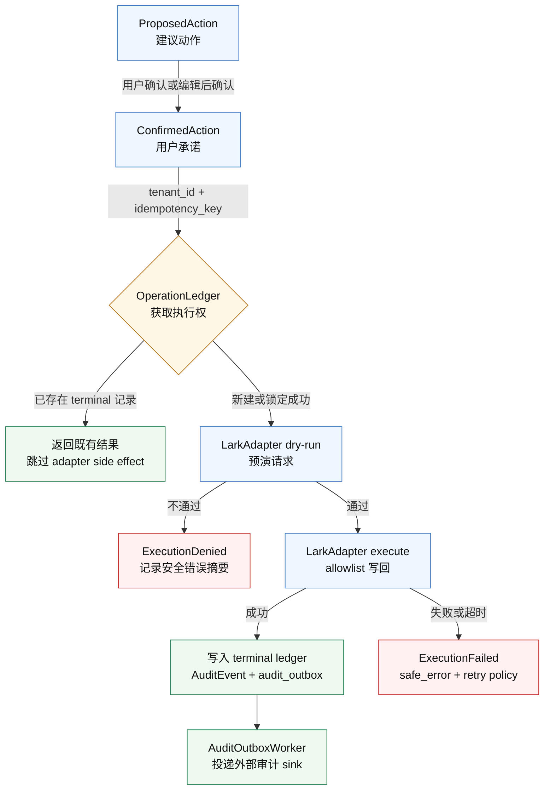

# 技术架构总览

更新日期：2026-05-31

## 1. 架构原则

OAR 的技术形态：

> Swift 原生前端 + Rust 后端/core + LarkAdapter + 服务端智能体运行时。

核心原则：

- 飞书是 OKR、Docs、Tasks、Meetings、Calendar、IM 的权威数据源。
- OAR 后端是复盘、待确认动作、审计事件、证据索引、记忆和同步游标的权威数据源。
- iOS / macOS / 飞书入口负责交互、查看和审批。
- 7x24 调度、同步、审计和工具执行在后端完成。

## 2. 原生技术形态

推荐实现：

| 层 | 技术 | 说明 |
| --- | --- | --- |
| macOS | SwiftUI + AppKit bridge | 原生窗口、sidebar、command menu、通知、deep link |
| iOS | SwiftUI | 轻量审批和提醒，不承载完整智能体运行时 |
| 后端 / Core | Rust | LarkAdapter、队列、审计、策略、工具执行、同步引擎 |
| 本地通信 | local HTTP / gRPC / XPC | macOS shell 可连本地 core；生产更推荐后端服务 |
| 服务端 | Rust service | 7x24 任务、OAuth token、同步、A2A server、审计存储 |
| 存储 | Postgres + 对象存储 + 向量索引 | 审计、待确认动作、证据摘要、记忆 |

关键判断：

- iOS 不适合作为 7x24 智能体执行环境，只作为审批和查看端。
- macOS 可以有本地 core，但不能依赖用户电脑在线完成组织级复盘。
- 真实 7x24 能力必须在服务端智能体运行时。
- Swift 前端只负责体验和状态展示，所有写回都通过后端的 `ConfirmedAction`。

## 3. 飞书 OpenAPI 主路径

OAR 的生产飞书集成以 **Rust 原生 OpenAPI adapter** 为主路径。业务层必须 **LarkAdapter 优先**，不能散落直接调用 HTTP、CLI 或未审计的 OpenAPI；阶段 0.5 验证过的 Lark CLI 能力只保留为本地验证、fixture 录制和 CLI 行为回归工具。

核心技术原则：

> 把飞书 OpenAPI 产品化成安全、可审计、可替换的强类型 adapter 层。

保守原则：

- 所有调用经过 `LarkAdapter`。
- 生产路径不引入跨语言 SDK bridge；Rust adapter 直接调用飞书 OpenAPI。
- `oar-core` 不依赖 HTTP runtime、CLI 或 SDK，只暴露 trait、domain 和安全 envelope。
- 每个外部调用都要有 typed request/response、allowlist、超时、响应长度限制、脱敏和审计。
- Lark CLI fixture 必须锁定版本和 schema 快照，用于验证 parser 与行为回归，不作为生产主通道。

阶段 0.5 实测结果见：[`feishu-integration.md`](feishu-integration.md)。

## 4. LarkAdapter

所有飞书能力必须经过 `LarkAdapter`，业务代码不直接散落调用 CLI 或 OpenAPI。

| Adapter | 责任 |
| --- | --- |
| `OkrAdapter` | 读取周期、Objective、KR、progress、alignment；必要时写回低风险进度或评论 |
| `EvidenceAdapter` | 从 Docs、Tasks、Meetings、Minutes、IM、Calendar 收集证据 |
| `ActionAdapter` | 将建议动作转成任务、提醒、评论、会议草稿 |
| `AuthAdapter` | 管理 app/user/bot 身份、scope 检查、缺权限引导 |
| `AuditAdapter` | 记录 OpenAPI 调用与 CLI fixture 回放、dry-run、确认、执行结果 |

最小接口：

```text
list_cycles(user_id, user_id_type) -> OkrCycle[]
list_cycle_objectives(cycle_id) -> OkrObjective[]
list_objective_key_results(objective_id) -> OkrKeyResult[]
list_progress(target_id, target_type) -> ProgressRecord[]
dry_run_create_progress(request) -> ToolDryRun
create_progress(confirmed_action_id, request) -> ProgressRecord
dry_run_update_progress(request) -> ToolDryRun
update_progress(confirmed_action_id, request) -> ProgressRecord
```

所有写方法必须接收 `confirmed_action_id`，并写入 `AuditEvent`。

### 4.1 ConfirmedAction 执行链路

当前 Phase 0.6 要证明的核心链路是：同一个确认动作只能进入一次外部写回路径，且每次结果都能被审计追溯。



注意：外部写回是不可回滚 side effect。`audit_outbox` 用来缩小“adapter 已成功但外部审计投递失败”的窗口；真实 crash recovery 和外部 sink 集成仍是 Phase 0.6 后续验证点。

## 5. 账号、身份与 7x24

账号模型：

| 对象 | 作用 |
| --- | --- |
| `Tenant` | 飞书企业租户，数据隔离和计费边界 |
| `WorkspaceUser` | OAR 内部用户，保存偏好、角色、记忆设置 |
| `LarkIdentity` | 飞书用户身份绑定，如 `open_id`、`union_id`、租户信息 |
| `RoleBinding` | manager、PMO、admin、viewer 等 OAR 内角色 |
| `DeviceSession` | macOS / iOS / web / 飞书入口的登录设备和会话 |
| `TokenGrant` | 用户或企业授权给 OAR 的 OAuth grant，必须加密存储 |
| `AgentActor` | 智能体执行时使用的身份描述，不直接等同于某个 token |

执行身份：

| 身份 | 来源 | 适合场景 |
| --- | --- | --- |
| `user_delegated` | 用户 Lark OAuth 登录后授权 | 读取用户可见 OKR、日历、任务、文档；执行用户确认后的写回 |
| `bot_actor` | 飞书 Bot / 企业自建应用 | 发消息卡片、提醒、确认入口、系统通知 |
| `app_actor` | 企业应用授权 | 组织级同步、公开团队 OKR、后台批处理 |
| `service_actor` | OAR 后端内部身份 | 调度、队列、审计、模型任务 |
| `approved_user_action` | 用户确认后的动作 | 写评论、建任务、提醒 owner、更新低风险字段 |

关键原则：

- Lark 登录可以自动绑定用户身份，但不能自动放大成“智能体拥有该用户全部权限”。
- 实际可用权限必须取 Lark app scopes、用户授权、资源权限和 OAR 策略 allowlist 的交集。
- 如果需要 7x24 后台运行，需要申请 `offline_access`。
- `refresh_token` 只在用户授予 `offline_access` 时返回。
- 刷新成功后必须保存新的 refresh token，原 refresh token 可能失效。
- `OAR_FEISHU_APP_ID` / `OAR_FEISHU_APP_SECRET` 标识 OAR 这个飞书应用或私有化部署，不是用户身份；
  用户扫码后生成的 `TokenGrant` 才是按 `tenant_key + open_id` 绑定的 delegated identity。
- 客户端只保存 OAR session，不长期保存飞书 refresh token。
- `TokenGrant` repository 边界只接受/返回加密授权包，不暴露明文 OAuth token。

## 6. 多端同步

飞书与 OAR 的职责分界：

| 系统 | 作为权威数据源的数据 |
| --- | --- |
| 飞书 | OKR、Docs、Tasks、Meetings、Calendar、IM 原始数据 |
| OAR 后端 | 每周复盘、待确认动作、审计事件、证据索引、记忆、同步游标 |
| 客户端 | UI 缓存、草稿、设备会话，不保存长期 token |

同步原则：

- 所有客户端通过 `sync_cursor` 拉取增量状态。
- 写操作必须使用 `idempotency_key`。
- 后端维护 `OperationLedger`，记录待确认、已确认、执行中、已成功、已失败、已取消。
- 同一个待确认动作在 macOS / iOS / 飞书卡片中的状态必须一致。
- 客户端离线时只能编辑草稿，不能离线确认真实写回。

## 6.1 Phase 0.6 持久化草案

Phase 0.6 的首版 Postgres migration 草案位于：

[`../crates/oar-core/migrations/0001_phase_0_6_identity_action_audit.sql`](../crates/oar-core/migrations/0001_phase_0_6_identity_action_audit.sql)

覆盖对象：

| 表 | 责任 |
| --- | --- |
| `tenants` | 企业租户隔离边界 |
| `workspace_users` | OAR 内部用户 |
| `lark_identities` | 飞书身份绑定 |
| `token_grants` | OAuth grant 元数据和加密授权包 |
| `device_sessions` | 多端会话和同步游标 |
| `confirmed_actions` | 用户确认后的动作 |
| `operation_ledger` | 幂等执行账本 |
| `audit_events` | append-only 审计事件 |
| `audit_outbox` | adapter 副作用与审计持久化之间的 crash-window 缓冲 |

关键约束：

- `confirmed_actions (tenant_id, idempotency_key)` 唯一。
- `operation_ledger (tenant_id, idempotency_key)` 唯一。
- `operation_ledger.action_id` 引用 `confirmed_actions.action_id`。
- `audit_events (tenant_id, trace_id, sequence)` 唯一；trace 查询必须携带 `tenant_id`，避免可猜 trace id 导致跨租户读取或冲突。
- `audit_events` 有 `BEFORE UPDATE` / `BEFORE DELETE` trigger 阻止静默修改。
- `token_grants` 不使用明文 `access_token` / `refresh_token` 列名，授权材料保存为 `encrypted_oauth_grant`、`oauth_grant_key_id`、`oauth_grant_fingerprint`。
- refresh rotation 采用 SQL CAS：`tenant_id + grant_id + expected_fingerprint` 命中且 grant 状态属于 `valid` / `needs_refresh` / `expired`、并满足 `revoked_at IS NULL` 与 `reauth_required_at IS NULL` 时才允许更新。
- 已撤销或已标记 reauth-required 的 grant 必须在 SQL 层直接阻断 rotation，不依赖上层重试逻辑。

当前边界：

- Rust core 默认构建仍使用 repository trait + in-memory repository 验证语义。
- Rust core 已新增 `storage::postgres` SQL 边界，覆盖 confirmed action / ledger upsert、guarded status transition、audit append、audit outbox enqueue 和 outbox claim/sent/retry/failed 状态更新。
- Rust core 已新增 Postgres `PostgresExecutionRecorder` storage 边界，可在一个 DB transaction 内提交 ledger + audit + outbox，并用 live tests 验证 audit append 失败时 ledger/outbox 一起回滚。
- Rust core 已新增 feature-gated async `PostgresActionExecutor` 运行时路径，覆盖 `ConfirmedAction -> dry-run -> execute -> terminal audit/outbox`，重复执行会跳过 adapter 和重复 side effects。
- Rust core 已新增 feature-gated `PostgresAuditOutboxWorker` 最小 drain 路径，使用 `attempt_count + lease_until` guard 防止陈旧 worker 误标 sent/retry/failed；dispatcher error 仍按 retryable 处理，但达到 `max_attempts` 后会转入 `failed` 并在 report 中计为 `exhausted`，作为本地 poison-message 隔离边界。
- `oar-lark-adapter` 已新增 feature-gated `AuditOutboxSink` / `AuditOutboxSinkDispatcher` 投递边界，把 core outbox message 收敛成最小安全 envelope；adapter 层已提供 HTTPS webhook sink，使用稳定 `delivery_id` / idempotency header 做幂等投递，且按 2xx / retryable / terminal 4xx 做安全分类。no-op/local placeholder 仅允许测试或本地 contract 验证，后台 daemon 不得用它作为默认装配。
- `audit_outbox.payload` 必须保持最小安全 envelope：仅保存可路由事件引用（例如 `event_id`、`trace_id`、`event_type`、`kind`），入库前拒绝 token、authorization、raw stdout/stderr、encrypted blob、fingerprint 等敏感字段或值。
- `audit_outbox` 的 pending claim 已补 tenant/stream 组合索引，匹配多租户 drain 查询形态，避免大表下按全局 status 扫描。
- `postgres` / `postgres-sqlx` feature 可编译 `sqlx` 版 Postgres repository 类型；默认构建仍不拉起数据库运行时依赖。
- `oar-http-facade` 已把真实 Rust auth refresh adapter 与 HTTPS webhook audit outbox sink 组装进 tenant maintenance daemon；daemon 在 facade 成功绑定监听后启动，并按 tick rediscover active tenants 执行 `refresh scheduled sweep + audit outbox drain`。`/healthz` 保持 liveness 语义并返回 safe aggregate daemon status；`/readyz` 按 daemon lifecycle、runtime round failure 和 stage failure 返回 200/503。两者只暴露启用状态、daemon state、轮次计数、租户失败聚合计数、`scheduled_sweep` / `outbox_drain` 安全 stage 指标和规范化 failure code，不得返回 tenant id、URL、原始错误、token、authorization code、fingerprint、encrypted payload 或外部 sink 细节。core/storage 已新增只读 operational recovery report，用于列出 failed outbox 与 parked grant 的安全恢复项；仍需补齐真实 Feishu 网络验证、crash recovery、确认后的 failed outbox requeue / refresh_config resume 写入口，以及更接近生产的并发/soak 测试。

## 6.2 Phase 0.6 下一切片：Identity Repositories + TokenRefreshDecision Bridge

状态声明：以下语义为当前实现/验证方向，属于进行中；只有在代码与集成测试覆盖后才可视为生产完成。

模块边界约定（当前实现）：

- `domain::token_refresh` 与 `lark::auth` 已移除 root `pub use` / facade 兼容。
- 新代码与文档示例应使用真实子模块路径：`domain::token_refresh::{bridge,decision,service,types}` 与 `lark::auth::{adapter,parser,types}`。

Phase 0.6 refresh 集成状态按五层区分（不得混写为“已生产就绪”）：

1. 安全 parser / adapter contract 层：定义可安全消费的 refresh 输入输出边界与 `RefreshOutcome` 映射（当前：部分通过）。
2. fixture replay -> Postgres orchestrator/Recorder/audit 层：以 fixture/fake adapter 验证 refresh 决策、CAS 持久化与 append-only 审计事务边界（当前：部分通过）。
3. safe transport client boundary 层：`FeishuAuthRefreshSafeClient` 已将上层 runtime transport 的 raw envelope 限制在 auth 边界内，加入响应大小上限、parser fail-closed 和安全错误分类；core 仍不执行 shell/CLI/OpenAPI（当前：部分通过）。
4. 具体 OpenAPI transport + scheduler 层：Rust 原生 Feishu OAuth refresh transport、AEAD 授权包解密、async safe client 和 async Postgres orchestrator 边界已能在单元测试中串起；adapter crate 侧已有 `DATABASE_URL` gated 集成测试覆盖 stored encrypted grant -> Postgres material store -> fake Feishu HTTP success / `20074` / `20037` / 5xx / material missing or malformed -> safe parser -> core async adapter -> Postgres CAS/audit，并验证 `refresh_config_required` 会暂停 due-candidate 重试、material failure 不发起 HTTP 且不 rotate。facade 已装配 tenant maintenance daemon 触发路径；真实 Feishu 网络调用、stage-level alerting/metrics、crash recovery 与生产监控闭环仍未完成。生产主路径优先采用 Rust 原生 OpenAPI adapter；`lark-cli` 仅保留为本地验证、fixture 录制和 CLI 行为回归工具。
5. 真实 HTTP 生产装配边界：HTTP endpoint、headers/body schema、response size limit、状态码/错误映射与 secret redaction 的装配仅允许位于 `crates/oar-lark-adapter`；`oar-core` 只消费 typed/safe envelope，不引入 HTTP runtime、请求拼装或第三方 SDK sidecar。

飞书接入决策：

- 官方服务端 SDK 当前未提供 Rust 主线 SDK，且 SDK 托管的是 `tenant_access_token` / `app_access_token` 生命周期，不托管 `user_access_token`；用户授权、refresh token rotation、reauth/config-required 分类仍必须由 OAR 后端实现。
- OAR 的生产主路径已采用独立 runtime adapter crate（`oar-lark-adapter`），用 Rust HTTP client 直接调用飞书 OpenAPI，并实现 OAuth v2 token/refresh、user info、OKR read/progress write 的最小 typed client 边界。
- refresh 生产装配必须使用 async adapter 边界：`token_grants` 只提供加密授权包、key id、fingerprint 与 scopes；Feishu `client_id/client_secret` 由独立 credential provider 注入，不写入 `token_grants`，也不得进入日志、审计或 outbox。
- 当前不引入跨语言 SDK bridge；事件订阅、卡片回调、IM/Docs 等后续能力优先纳入同一个 Rust 原生 OpenAPI adapter 边界。
- `oar-core` 保持 core/storage/contracts 边界，只依赖 `AuthAdapter` / `LarkAdapter` trait 和安全 envelope，不直接依赖任何 HTTP runtime 或 CLI。

当前切片说明（core sweep 与 facade scheduler 分层，已部分验证）：

- core 层验证的是“安全候选选择 + 显式单次 sweep”：在 Postgres 侧按 `tenant_id` 选择 refresh due-candidates；后台周期触发只在 facade runtime 层装配。
- 在候选选择之上，已新增“显式单次 sweep / `run_once`”执行切片：仅在人工或上层流程显式触发时运行一次，逐 grant 调用既有 orchestrator/Recorder/audit 编排链路。
- 候选范围仅限 `due` / `needs_refresh` / `expired`，并在查询层排除 `revoked` / `reauth_required` grant。
- `refresh_config_required` 表示飞书应用配置缺失（例如官方 refresh user_access_token 开关未开启），不是普通 transient；标记该错误的 grant 会从 due-candidate 查询中暂停，直到后续配置修复后由显式恢复流程清除错误。
- 返回快照遵循最小暴露：仅返回 grant id、tenant id、状态、是否有 refresh material、CAS 所需 fingerprint 等编排必需元数据；不返回 `encrypted_oauth_grant` 或任何明文 token，fingerprint 不得写入日志或审计。
- sweep 事务边界保持在“每 grant 一次 orchestrator/Recorder 事务提交”，不将整轮 sweep 作为单个跨 grant 大事务。
- 已加入 `DATABASE_URL`-gated Postgres live tests 覆盖单次 sweep 的成功批次、顺序审计、候选过滤继承、`limit = 0` 不调用 adapter 且不写 audit。
- scheduler 侧已补齐 durable Postgres lease primitive，作为 sweep 执行前的租约门禁；scheduled sweep 会在拿租约前用 insert-if-missing bootstrap 缺失的 recurring job，且不重置已有 `pending` / `running` schedule；未拿到租约时不得执行 refresh sweep。
- scheduled sweep report 保留 acquisition detail（例如 busy retry-after 与 not-due next-due），审计序列按 lease attempt 分配独立 window，避免重试复用同一 trace 时轻易碰撞 `(trace_id, sequence)`。
- scheduled sweep 需要使用 `limit + 1` 作为 backlog 探针：只处理前 `limit` 个 grant，额外候选仅用于 `has_more`，不得分配审计 sequence 或触发 adapter/Recorder；当 `has_more` 为真时，下一次运行应使用短 `backlog_next_run_delay_ms` 而不是常规长周期，避免大租户剩余 due grants 被饿住。
- 当前 scheduler recurring 状态模型仅实现 `pending` / `running`，尚未引入 terminal `completed` / `failed` 生命周期语义。
- 该 core 能力用于 scheduler/worker 对接前的安全编排准备；facade 已负责外层周期驱动，但仍不应表述为“已具备生产无人值守 refresh 闭环”。

### 6.3 Tenant maintenance one-shot contract（runtime 前置契约）

- `oar-core` 继续保持 pure core/storage/contracts 边界：不在 core 内实现 daemon、poll loop、HTTP/gRPC runtime。
- core 只暴露“单次租户维护 tick（one-shot tenant maintenance tick）”能力，供上层 runtime 显式触发；后台常驻调度由 facade runtime 装配，不下沉进 core。
- one-shot tick 串联两段 tenant-scoped 维护流程：`lease-gated token refresh scheduled sweep` 与 `audit outbox drain`。二者都按显式触发执行一次，不在 core 内自循环。
- tenant maintenance config 必须 fail-closed 校验：`tenant_id` / `lease_id` / `audit_stream` / `scheduled_audit_trace_id` 不可为空；`lease` / `retry` / `delay` / `limit` / `batch` / `max_attempts` 相关数值必须为正；`0` 或空字符串不是 noop，而是无效配置并应被拒绝（`try_new` 返回错误，`new` 不应静默降级）。
- tick 返回两段独立 stage report：`scheduled_sweep` 与 `outbox_drain` 分别表达 `Succeeded(T)` 或 `Failed(safe_error)`，上层 runtime 可按阶段观测失败而不需要读取底层 raw error。
- 两段 stage 必须尽力执行：即使 scheduled sweep 遇到 Postgres 查询等硬错误，也不得跳过 audit outbox drain，避免审计投递因 refresh 调度异常被饿死。
- stage failure 仅暴露 allowlist 分类字符串；不得透出 SQL 原始错误、raw token、raw CLI stdout/stderr、encrypted blob、fingerprint 或 sink 内部细节。
- 当前已新增 `crates/oar-runtime` 作为最小 runtime 壳，用 Tokio `interval` + `CancellationToken` 驱动周期 tick；循环调度语义属于 runtime，不下沉到 core。
- runtime report 只保留成功/失败计数与 last tick，避免长期 daemon 累积无界历史；tick error 日志只记录 allowlist safe error 分类。
- runtime 已新增多租户 registry 前置边界，可按 tick 周期顺序触发多个 named tenant maintenance tick，单租户失败不会阻断后续租户；registry report 仅保留 completed round、每租户成功/失败计数和 last tick。
- runtime 已新增 tenant discovery / registry builder 前置边界：`RuntimeTenantDiscovery` 负责发现 tenant id，`RuntimeTenantTickFactory` 负责为租户构造 one-shot tick，`TenantMaintenanceRuntimeRegistryBuilder` 在构建阶段 fail-closed 校验空列表、空白/重复 tenant id、zero interval 以及 discovery/factory 安全错误；当前提供 `StaticRuntimeTenantDiscovery` 作为配置驱动/测试接入口，并提供 `PostgresRuntimeTenantDiscovery` 通过 `PostgresTenantRepository::list_active_ids` 读取 active tenants。
- runtime tick future、auth refresh async adapter、Feishu auth transport 和 audit outbox dispatcher 已收敛到 `Send` future 边界，为后续多线程 Tokio 调度留出装配空间。
- 安全边界保持不变：refresh 仅经 `AuthAdapter`；不得记录或暴露 raw token、raw CLI stdout/stderr；OKR 写回仍只允许 `ConfirmedAction -> OperationLedger -> PlatformAdapter -> AuditEvent`。
- 当前 facade 已完成真实 `AuthAdapter` production 装配、runtime tick factory production wiring、webhook outbox sink 装配，以及 `/readyz` stage-level 安全聚合观测；core/storage 已新增只读 operational recovery report 与 runbook，用于恢复规划，不执行 requeue/resume。retry/backoff 策略、crash recovery、确认后的 failed outbox 运维写入口和生产监控闭环仍未完成，本切片不构成生产无人值守闭环声明。

### 6.4 依赖技术雷达边界

- [`docs/reference/dependency-radar.md`](reference/dependency-radar.md) 定位为“推荐依赖/技术雷达”，用于候选与分层边界说明，不等同于已采纳的架构决策或 Phase 0.6 交付承诺。
- 当前可固化在 core/storage 安全边界内的依赖：`secrecy`、`aes-gcm`、`sha2`、`hmac`、`sqlx`（按最小需要引入）。
- 明确禁止侵入 `oar-core` 或当前 Phase 0.6 生产路径的候选项：`axum`（runtime/gateway 层）、向量检索栈（如 `fastembed` / `pgvector`）、文档解析（PDF/HTML）、通用重试库（如 `backon`）。这些仅可在 POC/外围 runtime 或后续阶段评估。

### Tenant / WorkspaceUser / LarkIdentity Postgres repositories（部分通过）

- `tenants`、`workspace_users`、`lark_identities` 作为身份主干表，所有读写均以 `tenant_id` 作为隔离前提。
- `LarkIdentity` 绑定只允许经 adapter 层写入，业务层不直接拼接飞书身份字段，避免绕开审计与策略边界。
- repository 已通过 live DB tests 覆盖显式唯一性与冲突语义：同 ID 跨租户冲突返回 redacted tenant mismatch，同租户下重复 external identity 绑定返回 typed conflict，供上层流程做幂等恢复。
- identity repository 不持久化明文 token；授权材料仍只经 `TokenGrant` 加密字段边界流转。
- identity 变更审计仍待补齐：至少记录 actor、绑定目标、变更前后摘要和 trace 关联。

### DeviceSession Postgres repository 语义（进行中）

- `device_sessions` 按 `tenant_id` 强隔离，所有读写必须携带租户上下文。
- repository 负责单调 `sync_cursor` 推进：新 cursor 必须严格大于旧值；回退或重复值被拒绝并返回冲突结果。
- repository 负责会话状态门禁：当会话被 revoke/expired 时，拒绝 cursor 推进与后续同步状态推进。
- repository 只保存 OAR 会话与同步元数据，不持久化飞书明文 token。
- 多端并发下以 SQL 原子条件更新保证“只前进不回退”，并为上层返回可审计的冲突信号。

### TokenRefreshService 编排边界（进行中）

- `TokenRefreshService` 只负责 grant 生命周期编排：到期判断、refresh 尝试、rotation 持久化、revoke/reauth 判定与审计记录。
- `TokenRefreshService` 当前可复用 Postgres 租户级 due-candidate 安全筛选作为 refresh attempt 输入前置，并可由显式单次 sweep（`run_once`）逐 grant 驱动；该步骤本身不触发后台调度循环。
- service 不向上层返回明文 access/refresh token；跨 repository 边界仅传递加密授权包与指纹元数据。
- refresh rotation 必须经 `TokenGrant` repository 的 SQL CAS guard（`tenant_id + grant_id + expected_fingerprint + state guard`）原子提交。
- grant 处于 revoked 或 reauth-required 时，service 必须短路并返回可恢复错误，不触发后台写操作。
- service 不直接调用任意 OpenAPI 或 CLI；与飞书交互必须经 `LarkAdapter/AuthAdapter` 封装路径，保留 dry-run/审计一致性。
- service 仅处理授权材料与状态，不直接执行 OKR 写回；业务写回仍必须走 `ConfirmedAction -> OperationLedger -> PlatformAdapter -> AuditEvent`。
- `TokenRefreshAuditSummary` 可通过 `token_refresh_audit_event` 映射为 append-only `AuditEvent`：复用现有 `ExecutionSucceeded` / `ExecutionFailed` / `ExecutionDenied` 类型，用 `target.resource_type = token_grant` 与稳定 `action_type` 区分 refresh 场景。
- refresh 审计事件只记录 grant id、tenant id、状态分类、命令分类和已脱敏 `safe_error`；不得记录 access token、refresh token、authorization code、raw CLI stdout/stderr、encrypted blob、fingerprint、完整授权包或 sink 内部错误。
- fingerprint 仅作为 CAS/并发控制元数据参与编排，不进入日志正文、审计 payload 或对外可见错误。
- 当前已在 Postgres live tests 验证 refresh 状态更新 + audit append 的事务化 Recorder 语义（同事务提交、审计失败整体回滚）。
- `PostgresTokenRefreshOrchestrator` 已验证 fake `AuthRefreshAdapter` -> domain decision -> transactional Recorder -> audit 的编排边界；短路路径不调用 adapter / Recorder，只写 denied audit。
- `PostgresTokenRefreshSweep` 已验证 tenant-scoped due-candidate 安全筛选到显式单次 `run_once` 的桥接边界，逐 grant 沿用 orchestrator/Recorder/audit 事务语义。
- `PostgresTokenRefreshSweep` 当前在 core 内仍仅提供显式触发的 `run_once` handler；lease gate 与 recurring `pending/running` 状态持久化基础已由 facade tenant maintenance daemon 周期驱动，daemon/poll loop 语义不下沉进 core。
- Auth refresh 已补齐 core-only safe transport client boundary：core 可消费上层 runtime transport 返回的 raw envelope，但 raw 内容只在边界内做大小检查与 parser fail-closed，不进入 domain/debug/audit；具体 Rust OpenAPI transport 与授权材料解密提供器已在 adapter crate 完成 fake HTTP 装配验证，并已接入 facade tenant maintenance daemon。真实 Feishu 网络验证、重试节奏和生产监控闭环仍待补齐，不构成生产 refresh 闭环。

### Auth refresh adapter contract / safe transport 边界（进行中）

- `AuthAdapter` refresh 路径当前已具备“safe transport client boundary”：上层 runtime 可以通过受控 transport 提供 refresh raw envelope，但 core 不负责执行 shell、CLI 或 HTTP/OpenAPI。
- parser 边界仅接受“加密授权包 envelope”（如 `encrypted_oauth_grant`、`oauth_grant_key_id`、`oauth_grant_fingerprint` 及最小状态元数据），不接受明文 token 字段穿透到 domain。
- parser 必须拒绝任何 plaintext token-like 输出：包含 access token、refresh token、authorization code 或等价敏感片段时，直接返回安全错误并停止后续 refresh 编排。
- safe client 在 parser 前执行响应大小上限检查，并把 transport、oversized、parse failure 分类成安全错误；raw stdout/stderr、完整原始响应、fingerprint 与 encrypted bytes 不进入 Debug/Display/audit。
- parser 输出必须映射为领域 `RefreshOutcome`（`Success` / `TransientFailure` / `ReauthFailure` / `ConfigRequired`），再由 `TokenRefreshDecision` bridge 映射到持久化命令。
- 安全错误仅允许输出 allowlist 摘要（`safe_error`）；不得记录或暴露 access token、refresh token、authorization code、raw CLI stdout/stderr、完整 adapter 原始响应。
- 该边界只解决“可安全消费 runtime transport 输出”；当前 Rust 原生 OpenAPI transport 已完成 fake HTTP 装配验证，并已接入 facade tenant maintenance daemon。真实 Feishu 网络验证、重试节奏、stage-level alerting/metrics 和调度生命周期仍待生产验证。`lark-cli` 只作为 fixture/验证工具，不作为生产主通道。

### TokenRefreshDecision persistence bridge（进行中）

- 引入 `TokenRefreshDecision` 作为 refresh 编排与持久化之间的显式桥接对象，用于表达 CAS rotation、needs-refresh 和 reauth-required 等持久化意图。
- bridge 的责任是把决策安全映射到 repository 可执行操作（如 CAS rotation、标记 needs-refresh、标记 reauth-required），并保留后续日志/审计所需的最小上下文。
- bridge 不承载明文 token，不向外暴露授权原文；仅携带指纹、状态、时间窗口和错误分类等最小必要元数据。
- 当 grant 已 revoked 或 reauth-required 时，refresh 编排必须在生成写入命令前短路，并输出可恢复错误给上层。
- bridge 只覆盖授权生命周期，不改变业务写回门禁：任何 OKR 写操作仍必须来自 `ConfirmedAction`，并通过 `OperationLedger` 与 `AuditEvent` 留痕。

## 7. 智能体运行时与模型配置

OAR 的智能不应该来自一次 LLM 调用，而应该来自：

> 模型编排 + 可追溯证据 + 可学习的团队记忆 + 可版本化策略。

当前模型 API 边界：

- 前端只调用 OAR backend endpoint，不直连 OpenAI-compatible 或 Anthropic 服务。
- 用户级 BYOK 设置由后端持久化：前端只提交 `baseURL` / `apiKey`，后端检测协议和模型目录，并用 `OAR_GRANT_KEY_*` 加密保存 API key。
- 后端 root persistence 由 `DATABASE_URL` + `OAR_GRANT_KEY_*` 初始化，独立于 Feishu login runtime；它承载 OAR session 校验、Review Inbox、Agent settings 和 Feishu grant 存储。
- 推理请求优先使用当前用户 BYOK 设置；没有用户设置时，后端才按 `OAR_AGENT_PROVIDER` 使用环境变量 fallback。
- 支持的默认协议为 `openai-compatible` 和 `anthropic`。OpenAI-compatible 需要 base URL、API key 和 model；Anthropic base URL/version 有后端默认值，但 API key 和 model 仍必须来自用户设置或环境变量。
- 后端把不同 provider 的流式响应统一转换为 OAR SSE；前端消费的是 OAR 事件契约，而不是 provider 原始协议。

模型角色：

| 模型角色 | 用途 | 要求 |
| --- | --- | --- |
| `fast_model` | 分类、摘要、长期未更新检测、低风险初筛 | 低延迟、低成本、稳定 JSON |
| `reasoning_model` | 每周复盘、复杂风险判断、建议动作 | 推理强、上下文长、结构化输出 |
| `embedding_model` | 证据检索、记忆检索 | 向量质量稳定、可批量处理 |
| `local_or_private_model` | 高敏企业数据场景 | 可私有化、可审计、可按租户关闭外部模型 |

每次生成复盘或建议动作时记录：

- `prompt_version`
- `policy_version`
- `model_provider`
- `model_version`
- `tool_schema_version`
- `output_schema_version`
- `evidence_ids`
- `memory_ids`
- `trace_id`

记忆架构见：[`memory-evidence.md`](memory-evidence.md)。

## 8. 证据链

OAR 的每条智能体判断都必须绑定来源。

| 智能体判断 | 可用证据来源 |
| --- | --- |
| KR 长期未更新 | OKR 更新时间、owner 最近消息、任务更新时间 |
| KR 低于预期节奏 | OKR progress、任务完成率、会议/文档中的阻塞点 |
| owner 未响应 | IM 搜索、任务评论、OKR 评论、会议纪要 |
| 目标缺证据 | Docs/Wiki/Minutes/Tasks 中找不到关联上下文 |
| 需要跟进 | Minutes 待办、Calendar 空档、Tasks 未完成项 |
| 可以更新 progress | 已完成任务、会议结论、owner check-in、Base/Sheets 指标 |

MVP 原则：优先保存摘要、来源引用和 hash，不默认保存完整原文。
