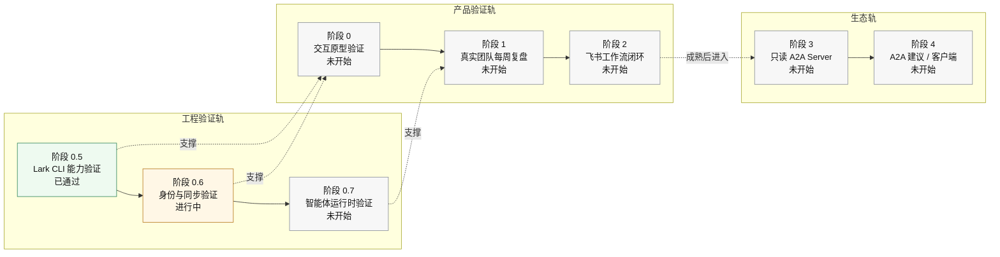

# 验证计划

更新日期：2026-05-26

## 1. 当前阶段

OAR 当前处于 **阶段 0.6：身份与同步验证**。

已完成：

- 阶段 0.5：`lark-okr` 已通过目标验证，可作为 OKR 只读主路径和 progress 创建 / 更新写回路径。
- 阶段 0.6 首轮：user / bot 身份、`offline_access`、`auth:user.id:read` 和 token valid 状态已验证。

生产闭环未完成（前置与部分验证已完成）：

- 已完成前置与部分验证：`TokenGrant` 领域边界、refresh 前置条件、`OperationLedger` 并发幂等切片、`DeviceSession` 同步语义切片。
- 未完成生产闭环：真实 `AuthAdapter` / client 接入、后台 scheduler/daemon、多端真实联调与一致性验证。

## 2. 路线图

OAR 当前有两条验证轨道：

- **产品验证轨**：验证用户是否真的愿意每周打开复盘收件箱，并持续处理 OKR 风险队列。
- **工程验证轨**：验证飞书集成、身份授权、token refresh、多端同步、幂等执行和审计边界能否支撑这个产品切口。

因此，“阶段 0 交互原型验证”未开始不代表工程不能先做 Phase 0.5 / 0.6。当前真实状态是：工程验证轨已推进到 Phase 0.6，产品验证轨仍需要陪跑式原型验证。

| 轨道 | 阶段 | 目标 | 状态 | 决策门 |
| --- | --- | --- | --- | --- |
| 产品 | 阶段 0：交互原型验证 | 验证复盘收件箱是否成立 | 未开始 | 用户愿意按每周流程处理风险队列 |
| 工程 | 阶段 0.5：Lark CLI 能力验证 | 决定 `LarkAdapter` OKR 主路径 | 已通过 | `T0-T9` 已完成；真实删除不进 MVP |
| 工程 | 阶段 0.6：身份与同步验证 | 验证代理身份、多端同步、幂等执行 | 进行中 | 后端能安全 refresh token，且同一动作只执行一次；过渡态：契约与编排已验证，真实客户端与后台调度待接入 |
| 工程/产品 | 阶段 0.7：智能体运行时验证 | 验证模型、记忆、证据存储能否稳定生成建议 | 未开始 | 建议质量可回放评估 |
| 产品/工程 | 阶段 1：内部 OAR 智能体 | 跑通真实每周复盘 | 未开始 | 1 个真实团队连续 2-4 周使用 |
| 产品/工程 | 阶段 2：飞书工作流闭环 | 让用户在飞书内处理动作 | 未开始 | 飞书卡片确认不低于桌面端 |
| 生态 | 阶段 3：只读 A2A Server | 对外提供 OKR 摘要能力 | 未开始 | 外部智能体只能读摘要 |
| 生态 | 阶段 4：A2A 建议 / 客户端 | 外部智能体可提交建议动作 | 未开始 | 仍由 OAR 用户确认后执行 |

图示：

## 3. 阶段 0.6 通过标准

阶段 0.6 通过需要同时满足：

- user / bot / app / service actor 边界清楚。
- OAR 后端能安全保存并刷新 `TokenGrant`。
- 客户端不保存飞书长期 token。
- `OperationLedger` 能防止重复执行。
- 多端能通过同一后端状态机看到一致动作状态。
- 所有写回都能追溯到 `ConfirmedAction` 和 `AuditEvent`。

如果无法做到：

- 无法安全保存或刷新 token：后台 7x24 降级为用户在线触发。
- 无法证明幂等执行：飞书卡片和移动端只允许查看，不允许确认写回。
- 多端状态不一致：先只保留 macOS 单端确认。

## 4. MVP 验证实验

第一阶段不要验证完整技术栈，而要验证用户是否真的需要每周 OKR 复盘驾驶舱。

陪跑式 MVP：

1. 找 3-5 位真实目标用户：经理、PMO、幕僚长、创始人。
2. 选 1-2 个真实团队和一个 OKR 周期。
3. 手动或半自动读取飞书 OKR、任务、会议、文档更新。
4. 用 OAR 原型生成每周简报、风险榜和建议动作。
5. 在飞书或 macOS 原型中让用户确认、编辑或拒绝动作。
6. 记录用户是否愿意下周继续使用，以及哪些建议被采纳。

通过信号：

- 复盘准备时间减少 50%。
- 建议动作的确认或编辑后确认比例达到 30%+。
- 用户能解释为什么相信或不相信证据链。
- 每周至少 1 次主动复盘会话。
- 用户愿意让 OAR 继续进入下一个 OKR 周期。

## 5. 风险与停止标准

主要风险：

- 拿不到足够的飞书 OKR / 任务 / 文档读取权限，导致无法形成证据链。
- 无法取得或合规保存 `offline_access` 授权，导致 7x24 后端智能体不能成立。
- 多端同步无法避免重复执行或状态不一致。
- 用户每周不愿打开复盘收件箱，说明工作流切口不成立。
- 建议动作确认率长期低于 10%，说明建议不可用或不可信。
- 企业更愿意直接在飞书内完成全部流程，独立桌面端没有明显效率增益。

只要这些风险还未被排除，A2A、通用智能体市场和复杂组织仪表盘都不应提前进入 MVP。
